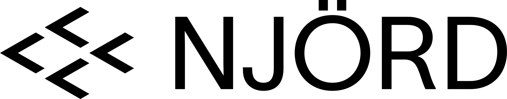

[![CC BY-NC-SA 4.0][cc-by-nc-sa-shield]][cc-by-nc-sa]

## Overview

Farmed salmon have traditionally been fed colorants to maintain their characteristic hue. This is typically done to replicate the natural color of wild fish, which is influenced by their diet rich in krill.

NJÖRD is a Norwegian company specializing in the production and distribution of colored salmon meat, offering a diverse range of products. Recently, NJÖRD introduced a new premium service that allows clients to control all visual characteristics of the fish. This service is accessible through dedicated machines installed in each store.

## Purpose

The provided repository contains the code for the NJÖRD machine's operation. It includes a configurator that enables users to create their own avatar, representing the fish they wish to purchase. The visualizer displays a summary of the choices made by the client. Additionally, an aquarium feature showcases the fishes purchased by all clients, facilitating comparison and sharing of experiences with others.

## Requirements

- NodeJs
- npm (server)
- yarn (client)
- Arduino board and IDE

## Components

### Tangible interface (Arduino)

Use your Arduino IDE to load the program found in `arduino_code`.

### Server

The server is located under _server_ folder and can be launched with the following commands:

    npm install
    npm run start

> **Note:** the Server is designed to connect to a serial port. Currently, the USB port identifier is hardcoded and therefore you may need to change it. In case the serial port is not available, the client still works but fishes can not be configured.

### Client

The client is located under _client_ folder and can be launched with the following commands:

    yarn install
    yarn start

Then, there are multiple sections that can be accessed with the following links:

- [Aquarium](http://localhost:3000/)
- [App (Configurator)](http://localhost:3000/configurator)
- [Visualizer](http://localhost:3000/visualizer?h=212&s=82&l=50&t=2)

## Credits

This is a work of Speculative Design for the course Final Synthesis Design Studio for the Bachelor's Degree in Communication Design.

---

### Third party materials

**Salmon Model**

The gltf file used in the code is based on the model made by NestaEric.

Model Information:

- title: Chinook Salmon ( Ocean phase )
- source: https://sketchfab.com/3d-models/chinook-salmon-ocean-phase-4d36e5f3db7e4c33908c42790e59caf3
- author: NestaEric (https://sketchfab.com/Nestaeric)

Model License:

- license type: SKETCHFAB Standard (https://sketchfab.com/licenses)
- requirements: Under basic restrictions, use worldwide, on all types of media, commercially or not, and in all types of derivative works

---

**Salmon Model**

The font used for the project is TWK Lausanne, designed by Nizar Kazan, as a student trial.

- license type: https://www.weltkern.com/support_/informations

© [TWK Lausanne] designed by [NIZAR KAZAN], published by WELTKERN®.

---

### Group members

- Bissoli Miriam
- Capozza Andrea
- Casadei Giorgia
- Coroneo Giovanni
- Le Bras Lili May
- Lucini Francesco
- Sicignano Lorenzo

_Polytechnic University of Milan  
School of Design  
Final Synthesis Design Studio  
AY 2023 — 2024_

### License

This work is licensed under a
[Creative Commons Attribution-NonCommercial-ShareAlike 4.0 International License][cc-by-nc-sa].

[![CC BY-NC-SA 4.0][cc-by-nc-sa-image]][cc-by-nc-sa]

[cc-by-nc-sa]: http://creativecommons.org/licenses/by-nc-sa/4.0/
[cc-by-nc-sa-image]: https://licensebuttons.net/l/by-nc-sa/4.0/88x31.png
[cc-by-nc-sa-shield]: https://img.shields.io/badge/License-CC%20BY--NC--SA%204.0-lightgrey.svg
